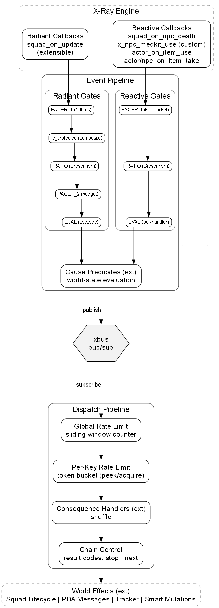
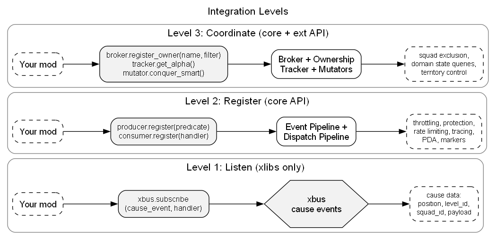

# AlifePlus Architecture

AlifePlus is a reactive framework for STALKER Anomaly. It hooks X-Ray engine callbacks, classifies them through cause generators, and dispatches consequences. Two pipelines:

- Event Pipeline (ap_core_producer): gate chain -> cause generator -> xbus publish.
- Dispatch Pipeline (ap_core_consumer): xbus subscribe -> consequence handler -> script_squad.

The framework owns protection (ap_core_broker), rate limiting (ap_core_limiter), squad lifecycle (ap_core_broker), tracing (ap_core_debug), PDA map markers (ap_core_map), and statistics overlay (ap_core_hud). Domain logic registers a cause generator with the producer and a consequence handler with the consumer.

Two layers: core (ap_core_*) and ext (ap_ext_*). Core never imports ext. All domain logic reaches the framework through registered function references.

Built on xlibs. _ap_deps asserts xlibs presence and version on load. See conventions.md for naming, result codes, MCM, logging.



---

## Vocabulary

- Cause: a labeled event the framework publishes. Specific name (cause:massacre, cause:hunger_campfire). Umbrella names (NEEDS, REACTIONS) are categories, never published.
- Consequence: a handler subscribed to a cause; runs the action and side effects.
- Cause generator: function that picks and emits one cause per call, or none. One generator per family. Files named ap_ext_cause_<family>.script for single-cause, ap_ext_causes_<family>.script for multi-cause.
- Cause type: RADIANT (squad-tick driven, 1:1 with consequence) or REACTIVE (engine-event driven, 1:N with consequences). Defined in ap_core_const.CAUSE_TYPE.
- Cause category: REACTIONS, NEEDS, INSTINCTS, OPPORTUNITIES. Behavioral axis parallel to cause type. Drives per-category rate-limit grouping and MCM organization. Defined in ap_core_const.CAUSE_CATEGORY.
- RULES: business checks that need no world scan. Toggle, alignment, species, personality, payload field, threshold, tactics. Cheap. Always cheapest-first.
- SCAN: world lookup. find_smart, find_squads, find_stashes. Two flavors: destination SCAN (locates a target smart) and responder SCAN (locates responder squads).
- ACTION: the consequence's effect. script_squad / script_actor_target, state mutation, news add, on_arrive callback.
- Hull(<drive>): Hull's drive reduction theory (1943). Score = weight * (elapsed / threshold)^2 (ap_ext_causes_needs.script:96-98). Squared exponent makes overdue drives compete strongly. Used by NEEDS (9 stalker drives) and INSTINCTS (5 mutant drives).
- MVT(<cause>): Charnov's marginal value theorem (1976). Binary patch-recovery gate: elapsed > threshold. Used by stash and area causes (6 OPPORTUNITY fields).
- personality(<TRAITS>): probability check on a faction or species. avg(traits) clamped to [PERSONALITY_FLOOR, PERSONALITY_CEILING], rolled per dispatch. Inverted traits resolve as 1 - base before averaging.
- tactics(<reason>): post-SCAN soft check on radiant decisions. Score starts at 1.0; each tactical concern subtracts a weight. math_random() > score returns FAILED_RULES with reason LOW_TACTICS. Conditions: last-of-faction at source (-0.20), smart already targeted by another scripted squad (-0.20). Radiant only; reactive bypasses (event responses are not voluntary picks). Implemented in `ap_ext_util.is_tactically_eligible`.
- Cross-DTO read: any cause generator may read any DTO; only the owning generator writes.
- Producer (ap_core_producer): runs the gate chain, evaluates cause generators, publishes to xbus.
- Consumer (ap_core_consumer): subscribes to xbus events, dispatches to consequence handlers.
- xbus: pub/sub event bus from xlibs. Causes publish, consequences subscribe.

---

## Invariants

Project-wide constraints that hold across all pipelines and modules.

- Core never imports ext. All ext modules reach core through registered function references at on_game_start.
- Cross-DTO read, single-writer write. Any cause generator may read any DTO; only the owning generator writes.
- Performance budget. Every measured flow (each bracketed `ap_core_debug.observe` label in the log: `[CONSEQUENCE_PHASE.FIND_TARGETS]`, `[CONSEQUENCE_PHASE.FIND_DESTINATION]`, `[STASH]`, ...) targets 0.1ms average per call and has a hard 4ms ceiling per call. No exceptions, including cold start, save load, and level transition. Any preload (index build, cache warm, registry walk) that would breach 4ms in a single tick must be frame-spread (xslice or equivalent), with the search path falling back to the un-indexed walk until the build completes. A flow that averages above 0.1ms, or that ever exceeds 4ms in a single call, is a regression and requires a perf task. See `doc/standards/code-standards.md` "Performance budget".

---

## File layout

Two layers. Core is the framework. Ext is the domain. Core never imports ext; all ext modules register with core via function references at on_game_start.

### Core (14 files)

| File | Role |
|------|------|
| _ap_deps | Dependency gate: assert xlibs installed and version-compatible |
| ap_core_const | Enums and timing constants: CALLBACK, CAUSE_TYPE, CAUSE_CATEGORY, RESULT, REASON, TRACE, RANGE_*. |
| ap_core_mcm | MCM defaults, cfg snapshot, UI builder, on_option_change |
| ap_core_debug | Logger, observe() tracing, bracket helper, result builders. Zero overhead below DEBUG |
| ap_core_cache | Per-level indexes over SIMBOARD.smarts_by_names (sync at actor_on_first_update), treasure_manager.caches (xslice step=3, ~2s warmup), and SIMBOARD.squads (sync at actor_on_first_update). Consumers fetch via smarts_on_level(level_id) / stashes_on_level(level_id) / squads_on_level(level_id) and pass as opts.source to xsmart.find_smart / xstash.find_stashes / xsquad.find_squads. Smarts and stashes never invalidate (LTX-baked positions). Squads update incrementally via squad_on_after_level_change (move between buckets) and server_entity_on_register / on_unregister (spawn / despawn); stale entries are a no-op cost because xsquad._squad_base_valid level gate is first |
| ap_core_util | xbus pub/sub wrappers, find_smart / find_squads with protection filters |
| ap_core_limiter | Rate-limit primitives. Pipeline family (real-sec, ephemeral): per-key cause counter, per-consequence token bucket, global radiant TTL counter. Balance family (game-sec, persisted): offmap dispatch counter |
| ap_core_producer | Event Pipeline: radiant + reactive gate chains, cause generator cascade, xbus publish |
| ap_core_consumer | Dispatch Pipeline: xbus subscribe, consequence iteration, result codes, rate gating |
| ap_core_broker | Squad lifecycle: protection, ownership registry, scripting, 20s scan, arrival, release, transit balance |
| ap_core_record | Activity record: FIFO of dispatched consequences with denormalized display facts; HUD / news / external integrators read from it |
| ap_core_map | PDA map markers rendered from activity record entries; 10s apply timer, 20s validate pass, 60s linger before unmark |
| ap_core_hud | Pipeline statistics overlay (UIStatsHUD): counters, gate breakdown, periodic dump |
| ap_core_compat | Save data cleanup for version upgrades, default ownership proxy (warfare) |

### Ext: cause and consequence files

Single-cause files (7), one cause per family: ap_ext_cause_alpha, ap_ext_cause_alphakill, ap_ext_cause_basekill, ap_ext_cause_harvest, ap_ext_cause_massacre, ap_ext_cause_squadkill, ap_ext_cause_wounded.

Multi-cause files (4): ap_ext_causes_area, ap_ext_causes_instincts, ap_ext_causes_needs, ap_ext_causes_stash.

Consequence files (11, always plural): ap_ext_consequences_alpha, ap_ext_consequences_alphakill, ap_ext_consequences_area, ap_ext_consequences_basekill, ap_ext_consequences_harvest, ap_ext_consequences_instincts, ap_ext_consequences_massacre, ap_ext_consequences_needs, ap_ext_consequences_squadkill, ap_ext_consequences_stash, ap_ext_consequences_wounded.

### Ext: named modules (8 files)

| File | Role |
|------|------|
| ap_ext_const | Domain const tables: CAUSE_CATEGORY, alignment_*, PERSONALITY traits, mutant species displays, range tiers |
| ap_ext_util | Domain gates: alignment / species / personality / tactics checks, FIFO-cached species resolution |
| ap_ext_common | Shared chase pattern: move_actor_chasers / make_move_smart_chasers / make_on_arrive |
| ap_ext_tracker | Domain state: kill counts, alphas, alpha-dead grace, stalker NEEDS DTO, mutant INSTINCTS DTO, squad OPPORTUNITY DTO |
| ap_ext_smart_mutator | Runtime smart terrain mutations: territory conquest (shared spawn) and mutant infestation (exclusive spawn) |
| ap_ext_object_mutator | Combat modifiers for alpha mutants and high-rank stalkers (hit power, panic immunity) |
| ap_ext_news | News composer: per-consequence templates, slot substitution, speaker selection, dynamic_news_manager dispatch |
| ap_ext_test | In-game debug commands |

---

## Pipeline

### Execution model

X-Ray runs Lua single-threaded. There is no concurrency within one engine tick. When the engine fires a callback like squad_on_update, the entire AP pipeline executes synchronously in one Lua call stack before control returns to the engine. Producer evaluates gates, cause generator runs, xbus publishes, consumer iterates consequences, each handler runs and may script a squad. All inside a single function call.

```
engine squad_on_update
  -> producer._on_radiant (gate chain: PACER_1, is_protected, RATIO, PACER_2)
    -> EVAL cascade: shuffle generators, try each, stop on first publish
      -> cause generator returns nil -> try next
      -> cause generator returns { cause = CAUSE.X, ...payload } -> publish + break
        -> xbus.publish (synchronous, inline)
          -> consumer._process (shuffle consequences, iterate)
            -> consequence handler returns { code = RESULT.X }
              -> script_squad sets scripted_target, registers arrival
          <- returns to producer
        <- cascade breaks on first publish
```

xbus.publish calls each subscriber inline and returns when all have finished.

### Event Pipeline (ap_core_producer)

Producer receives engine callbacks and filters them through a gate chain before evaluating cause generators. Two variants because radiant and reactive events differ structurally.

Radiant events are ambient observations on squad_on_update. The squad is both sensor and responder. High frequency, low significance per event.

Reactive events are world-state changes on engine callbacks (death, healing, pickup). The triggering entity may not be the entity AP acts on. Low frequency, high significance per event.

#### Radiant gate chain (ap_core_producer._on_radiant, line 215)

squad_on_update is the only stable, uniform heartbeat covering both online and offline squads. Engine fires it from sim_squad_scripted:update() for every squad every tick. Online ~3/sec per squad, offline ~0.03/sec per squad via A-Life scheduler round-robin (~6,600 calls/min raw across ~776 squads). The gate chain reduces this to a manageable rate.

Five gates (header at ap_core_producer.script:214):

1. PACER_1. Coarse rate limiter. Pure os.clock() with 100ms interval (~10 admits/sec). Runs before any squad field access. No squad.id, no luabind. Rejects ~98% at near-zero cost.
2. is_protected. Full eligibility check via ap_core_broker.is_protected. Runs on ~10 squads/sec from PACER_1. Checks ownership, scripted, permanent, active_role, task_target. Short-circuits early.
3. RATIO. Bresenham integer admission gate. Off-map outnumber on-map ~50-100:1 per squad (online fires at frame rate, offline via scheduler round-robin). Cross-multiplication: throttled_count * |r| <= (10 - |r|) * favored_count. At default ratio 8 admits ~4 on-map per 1 off-map. squad.online (C++ m_bOnline, refreshed by check_online_status() before the callback) is the source. Separate counter pairs for radiant and reactive (_radiant_ct, _reactive_ct). Counters reset at 32768. Must run after is_protected so it only balances eligible squads.
4. PACER_2. Budget limiter. os.clock() with cfg.distributor_interval_sec (default 15s, ~4 triggers/min). Every PACER_2 admit produces an EVAL.
5. EVAL (cascade). Shuffles registered cause generators in-place inside a reusable buffer, walks them in random order. Each generator self-gates the per-CAUSE_CATEGORY rate (check_cause_rate_limit at the top of the predicate); the producer does not rate-check. First generator to publish stops the cascade. Each generator's `_on_smart` carries its own internal SCAN budget RADIANT_MAX_SCANS_PER_GENERATOR = 2 (`ap_core_const.script:146`); RULES rejections are free and the generator can cascade through all of its causes, but only causes that pass RULES and enter their world SCAN consume a slot. Budget is a local Lua counter, resets every `_on_smart` call.

Shuffling ensures fair distribution regardless of how many generators apply to a given squad's alignment.

#### Reactive gate chain (ap_core_producer._on_reactive, line 259)

Reactive callbacks: squad_on_npc_death, x_npc_medkit_use (custom), actor_on_item_take, npc_on_item_take, actor_on_item_use. Three gates:

1. PACER. Token bucket with per-callback-type keys, 1 token/sec per type. Independent from the radiant pacer.
2. RATIO. Same Bresenham as radiant with its own counter pair. Some reactive callbacks (actor_on_item_use, actor_on_item_take) are always on-map (require a game_object which only exists online).
3. EVAL (per-handler walk). Iterates all reactive cause generators for this callback in registration order. Each generator self-gates its rate; the producer does not rate-check. All evaluate independently. A single death event can trigger MASSACRE, SQUADKILL, ALPHA generators in sequence. Reactive does NOT cascade-and-stop - every generator gets its chance to publish.

#### Protection layers

Protection is applied at four layers, same guard set against different entities depending on context:

| Layer | Where | Subject |
|-------|-------|---------|
| Producer | radiant gate 2 (is_protected) | triggering squad |
| Cause | reactive cause generators | the entity AP would act on (killer, patient, taker) |
| Consequence | ap_core_util.find_squads | every candidate responder squad |
| Squad | ap_core_broker.script_squad | no inline check; protection is upstream |

Reactive causes skip the producer protection gate because the callback entity (e.g. dead victim in squad_on_npc_death) is not the entity AP would script. They check protection on the relevant entity inside the generator: alpha and alphakill guard the killer, wounded guards the patient, harvest guards the taker. Causes whose trigger is a dead victim (massacre, squadkill, basekill) need no in-cause guard - consequences find responders through find_squads which applies all exclusions.

script_squad does not check protection. It assumes upstream layers verified the squad. Direct callers outside the pipeline must check is_protected themselves.

#### Cause generator contract

Takes the callback args, returns either a payload tagged with the picked specific cause or nil. Generators self-gate the per-category rate via ap_core_limiter.check_cause_rate_limit and increment_cause_counter; the producer does not gate cause budgets. Producer wraps every generator call in observe(trace, entry.name, entry.handler, ...) so rejection branches (no result.cause) still log. Single-cause reactives register name = CAUSE.X; multi-cause radiants register name = family string (stash, area, needs, instincts) and additionally wrap each per-cause attempt in observe(trace, cause_const, ...) so picked causes nest under the family.

```lua
local CATEGORY = CAUSE_CATEGORY.OPPORTUNITIES
local function _predicate(trace, squad)
    if not cfg.cause_X_enabled then return { code = RESULT.FAILED_RULES } end
    if not ap_core_limiter.check_cause_rate_limit(CATEGORY, cfg.cause_max_opportunities) then
        return { code = RESULT.FAILED_RULES, reason = REASON.BUDGET_EXHAUSTED }
    end
    -- RULES + SCAN, then on success:
    ap_core_limiter.increment_cause_counter(CATEGORY)
    return { cause = CAUSE.X, ...payload }
end
```

Generators are pure: no rate-limit awareness from outside, no counter manipulation, no side effects beyond the published payload.

#### Instrumentation

Both pipelines measure gate span and eval span. Gate span: time from first eligibility check to budget admission (radiant: is_protected + RATIO + PACER_2; reactive: PACER + RATIO). Eval span: cause generator evaluation, xbus dispatch, all consequence handlers. Spans accumulated per PACER_LOG_INTERVAL (60s) and reported as avg/max in the periodic [PIPELINE] dump. All timing uses os.clock() and is gated by debug enablement; zero overhead when log level is above DEBUG.

### Dispatch Pipeline (ap_core_consumer)

After a cause publishes to xbus, the consumer receives the event and iterates registered consequence handlers. Loop in ap_core_consumer._process; per-handler steps in _dispatch_entry.

#### Per-handler dispatch

Per consequence:

1. condition pre-gate. Function registered at consumer.register, typically the MCM enabled flag. False -> SKIP this consequence.
2. Per-consequence rate limit (ap_core_limiter.check_consequence_rate_limit). Exhausted -> SKIP.
3. Global radiant rate limit (radiant only, ap_core_limiter.check_global_consequence_rate_limit). Exhausted -> STOP the entire loop.
4. Handler runs. Returns { code = RESULT.X, reason = "..." }. FAILED_RULES (business rules rejected: alignment, personality, species, validation), FAILED_SCAN (rules passed but world query empty), FAILED_ACTION (rules and scan passed but the action failed: script_squad could not route, registration call returned false), SUCCESS.
5. On SUCCESS: increment per-consequence counter; for radiant only, increment global radiant counter; set event_data._fired = true. For radiant, also stop the loop (rule 5 below).

DISABLED is the rules-layer skip for a consequence whose MCM toggle is off. Semantically equivalent to a FAILED_RULES with reason="disabled"; emitted by the consumer pre-gate (`ap_core_consumer.script:87`) so the handler is not called. The four phase codes are still what the handler returns when it runs.

#### Dispatch rules

1. Radiant cascade (producer-side). Producer shuffles registered radiant generators and cascades through them in random order. First generator to publish stops the cascade. Remaining generators do not evaluate.
2. Cause publish contract. A cause generator must not publish if no consequence can act. Cascade stops on publish - if every consequence rejects, the trigger is wasted. Causes serving a subset of alignments must filter at the cause level (alignment_human for stash/needs, alignment_mutant for instincts) rather than relying on consequences to reject.
3. Per-need / per-instinct routing. Needs and instincts each register one generator with the producer but publish specific xbus events per need/instinct (cause:hunger_campfire, cause:heal_shelter, cause:scatter, etc.). Each consequence subscribes to its specific event. Only consequences that handle the winning need/instinct receive the event. No mismatch iteration.
4. Consequence shuffle. The consumer shuffles registered consequences before iterating so order is not fixed. Reactive causes have multiple consequences (e.g. massacre_investigate and massacre_scavenge); shuffling matters. Radiant causes have one consequence each (1:1 shared noun), so the shuffle is a no-op.
5. Radiant: at most one consequence runs per cause. 1:1 shared noun. The consumer runs it or skips it; no loop, no alternatives.
6. Reactive: all run independently. All consequences for the cause run regardless of results. Multiple consequences can fire from a single event.
7. Loop stop (reactive only). The reactive loop stops when REACTIVE_MAX_CONSEQUENCES_PER_CAUSE = 2 consequences have actually run. Other results (FAILED_RULES, FAILED_SCAN, FAILED_ACTION, DISABLED, rate-limited) skip and continue.

### Rate limiting

ap_core_limiter holds two limiter families. Pipeline limiter throttles event flow so the engine doesn't churn (real-sec clock, ephemeral). Balance limiter caps in-world impact so the world doesn't drift (game-sec clock, persisted across save/load). The other layers live in producer or in cause generators.

| Layer | Mechanism | Scope | Default | Lives in | Config |
|-------|-----------|-------|---------|----------|--------|
| Per-key cause counter | TTL counter, sliding window | per CAUSE_CATEGORY | 20 / 60s | ap_core_limiter (check_cause_rate_limit, increment_cause_counter) | MCM cause_max_<category> |
| Per-consequence token bucket | peek / acquire | per consequence name | 2 / 60s | ap_core_limiter (check_consequence_rate_limit, increment_consequence_counter) | MCM consequence_max_events |
| Global radiant TTL counter | TTL counter | radiant only | 5 / 60s | ap_core_limiter (check_global_consequence_rate_limit) | MCM global_consequence_max_events |
| Offmap balance counter | TTL counter, sliding window (game-sec) | per source level_id | 2 / 48 game-hours | ap_core_limiter (check_offmap_rate_limit, increment_offmap_counter) | MCM cause_max_offmap |
| PACER_1 | os.clock interval | global radiant | 100ms | ap_core_producer | constant |
| PACER_2 | os.clock interval | global radiant | 15s | ap_core_producer | MCM distributor_interval_sec |
| Reactive PACER | token bucket | per callback type | 1 / sec | ap_core_producer | constant |
| Per-squad MVT / Hull threshold | DTO last_<X>_at + arrival reset | per squad per cause | per cause | cause generator | MCM cause_<X>_threshold |

Per-squad threshold (Hull / MVT). Owned by each cause generator. Reads last_<X>_at from a DTO (_ap_stalker_needs, _ap_mutant_instincts, _ap_squad_opportunities); arrival action resets the timestamp. Hull family (needs, instincts) is per-drive: multiple answers under one drive share the timestamp; any answer firing resets the drive's field. Score = weight * (elapsed/threshold)^2. MVT family (stash, area) is per-cause: each cause has its own threshold and timestamp. Gate is binary: elapsed > threshold.

Per-category cause budget is consumed inside the cause generator (self-gating). The producer does not gate cause budgets. A rate-blocked generator is skipped by the EVAL cascade so the slot frees for the next entry. ap_core_limiter.create_cooldown is a small helper for arbitrary timestamp-based cooldowns.

Offmap balance counter. Backs the offmap cause family (SOCIAL_OFFBASE, SUPPLY_TRADER_OFFMAP, JOB_EXPLORE_OFFMAP). Single counter keyed by source level_id; faction-agnostic and destination-agnostic; shared across all offmap causes. Window OFFMAP_WINDOW_SEC (48 game-hours, hardcoded) mirrors the framework pattern where pipeline windows are const and only caps are MCM-exposed (cause_max_offmap, default 2). Clock is xtime.game_sec; bucket state round-trips through save/load via xttltable export / import in ap_core_limiter SAVE_STATE / LOAD_STATE. Off-map filters are prop-only (xsmart.is_base / _is_unclaimed) because smart.stalker_jobs is nil for off-actor-level smarts (smart_terrain.script:462 load_jobs early-exits when not on actor level); has_animated_stalker_jobs / has_stalker_jobs / has_anomaly cannot be used on off-level candidates.

The world tab in MCM houses the balance family. Pipeline family caps live under framework. Reset button moved to the development tab.

### Tracing

Hierarchical via observe() (consequences, internal phases) and prof + trace:push + debug pattern (cause generators) in ap_core_debug. Each trace carries a monotonic tid (trace ID) and a slash-separated path (span hierarchy). One tid links a cause through its consequence chain into individual actions:

```
[NEEDS] [tid=42 path=needs] FAILED_RULES:WRONG_PERIOD sq=1337 [0.05ms]
[CAUSE.HUNGER_CAMPFIRE] [tid=42 path=needs/cause:hunger_campfire] sq=1337 drive=hunger weight=4.2 [0.15ms]
[CONSEQUENCE.HUNGER_CAMPFIRE] [tid=42 path=needs/cause:hunger_campfire/CONSEQUENCE.HUNGER_CAMPFIRE] success count=1 [0.83ms]
[CONSEQUENCE_PHASE.FIND_DESTINATION] [tid=42 path=needs/cause:hunger_campfire/CONSEQUENCE.HUNGER_CAMPFIRE/CONSEQUENCE_PHASE.FIND_DESTINATION] ok id=445 [0.12ms]
```

Path root is the registered name. Single-cause reactives register the specific cause (cause:massacre etc.) so the root IS the specific cause. Multi-cause radiants register the family string (stash, area, needs, instincts); generators have to run alignment / scan / pick code before a specific cause is known, so the root names the family and the picked cause nests one level under. First line in the example shows a pre-pick rejection (no cause picked, logs under family); subsequent lines show the picked-cause chain.

bracket(constant) in ap_core_debug composes log labels by uppercasing and replacing : with .: "cause:hunger_campfire" -> "[CAUSE.HUNGER_CAMPFIRE]". Each cause/consequence file caches its bracket strings at module load. No hardcoded [CAUSE.X] literals.

Below DEBUG: observe() is a bare passthrough (calls the function, returns the result). trace() returns a null singleton. xprofiler.new_if(false) returns a null singleton. Cost: one enabled() check (~150ns) per call. All null singletons pre-allocated; no allocation at non-debug levels.

---

## Initialization

Four phases. Each requires the previous to complete.

### Phase 0: module load

Engine auto-load resolves .script files on first namespace access (script_engine.cpp:375 sets _G.__index = auto_load). axr_main.on_game_start() iterates .script files alphabetically and triggers auto-load. Module-level code runs immediately on first reference: engine globals cached to locals, constant tables built, xlibs API references captured. No game state at this point - no actor, no entities, no callbacks active.

### Phase 1: on_game_start

axr_main calls on_game_start() on every loaded script. File order alphabetical, but all operations are independent - no cross-module reads at this phase:

- _ap_deps asserts xlibs compatibility. Hard crash on mismatch.
- ap_core_mcm loads config from defaults, registers on_option_change.
- ap_core_debug registers actor_on_first_update for deferred log level init.
- ap_core_producer resets dispatch state, registers actor_on_first_update. register() is write-through (maintains _handlers, _radiant_callbacks, _cascade_buf synchronously); engine subscription is deferred to actor_on_first_update.
- ap_core_consumer registers actor_on_first_update. Does NOT subscribe to xbus yet.
- ap_core_broker registers save/load callbacks, creates the 20s scripted-squad scan timer.
- ap_core_hud resets statistics, registers first_update / option_change / net_destroy / GUI callbacks.
- ap_core_map registers first_update (marker init) + server_entity_on_unregister (marker cleanup on entity death).
- ap_core_compat registers load_state for save cleanup, registers ownership proxy (warfare).
- ap_ext_cause_* / ap_ext_causes_* register generators with producer via register().
- ap_ext_consequences_* register handlers with consumer via register(). Arrival handlers via consumer opts.
- ap_ext_news registers compose timer.

After phase 1: all generators and handlers are registered, _cascade_buf is fully populated (write-through from register()). No engine callbacks subscribed yet, no xbus subscriptions active. Subscription is deferred to actor_on_first_update so predicates do not run before the actor and supporting systems are live.

### Phase 2: actor_on_first_update

Game world and actor exist. Deferred init runs:

- Producer subscribes to engine callbacks (radiant: shared _on_radiant; reactive: per-callback dispatcher) and sets _first_update_done. Late register() calls (post-first_update) subscribe new callbacks synchronously.
- Consumer subscribes to xbus cause events.
- Debug reads MCM log level (config now loaded), dumps MCM at DEBUG.
- HUD clears stale map markers from previous session, starts marker timer if MCM map_markers is enabled. Activates statistics overlay if MCM statistics_position is not "off".

actor_on_first_update fires on the first frame with a live actor. It fires on every level transition (not just game start), so handlers use a _subscribed guard to prevent duplicate registration. Named function references registered via RegisterScriptCallback are naturally deduplicated; the guard prevents redundant work.

### Phase 3: on_game_load

Fires after STATE_Read rebuilds all server entities from the save file. At this point alife_object(id) works and entity mutation is safe. Smart mutator re-applies conquered and infested smart data from _conquered_pending and _infested_pending (two-phase restore: load_state reads the data, on_game_load applies the mutations, because load_state fires before entities exist).

Engine load sequence:

1. load_state - save data read (m_data available). Entities do NOT exist yet. `alife_object(id)` returns nil; `level.get_start_time` AVs.
2. STATE_Read - engine deserializes server entities, rebuilds smart terrain config from LTX.
3. on_game_load - entities exist; mutations safe to apply.

Migrations that need to clear engine state (e.g. `scripted_target` on orphan squads) must split into a phase A queue at load_state and a phase B drain at on_game_load. See `doc/standards/code-standards.md` Save Data Migrations for the pattern; `ap_core_compat.script` and `ap_ext_smart_mutator.script` are the reference implementations.

---

## Engine integration

NPC behavior is produced by a four-layer engine chain. AP routes squads to destinations, reads the chain's output, and stays outside the chain itself.

### The four layers

| Layer | Subsystem | What it produces |
|-------|-----------|------------------|
| Content | smartcovers, patrol paths, animpoints (level .ltx) | the animation primitives a job can run |
| Binding | gulag (smart_terrain.script + gulag_general.script) | npc_info[id].job per NPC, scored by priority + precondition |
| Scheme | xr_logic + scheme modules (xr_walker, xr_camper, xr_sleeper, xr_animpoint, xr_smartcover, sr_*) | actions and evaluators registered on the NPC's motivation_action_manager |
| Execution | GOAP action planner (action_planner_script.cpp) | the per-tick action selected against goal world state |

### Write surface

A single engine field: `squad.scripted_target` via `xsquad.acquire_squad` / `release_squad` / `reassert_target`. AP does not write to `npc_info`, `npc_by_job_section`, `job_info_by_job_type_id`, `db.storage[id].active_section` / `active_scheme` / `pstor`, `motivation_action_manager`, or any smart's `stalker_jobs` / `monster_jobs` tables. AP does not call `xr_logic.activate_by_section` or any scheme's `set_scheme` directly. AP does not push exclusive jobs.

### Read surface

| Source | xlibs wrapper | Reader |
|--------|---------------|--------|
| `smart.stalker_jobs` / `monster_jobs` | `xsmart.has_animated_stalker_jobs` | scan-time predicate per cause: reject stub-only smarts (job_type_id in {0, 1}) |
| `smart.npc_info[id].job` | `xsmart.has_jobs_for` | arrival + mid-hold predicate: detect engine binding failure |
| `smart.props` | `xsmart.has_faction`, `accepts_mutant` | scan-time faction gate (mirrors engine target_precondition gate 1) |
| `SIMBOARD.smarts[id].squads` | `xsmart.has_capacity` | sim-routing intent (not physical occupancy; see SIMBOARD bookkeeping below) |

Cause-side filters live in `ap_ext_causes_*.script`; each cause picks the predicate set that matches the activity (surge shelter, lair, base/unclaimed, has-anomaly, etc.).

### Binding race

Engine `select_npc_job` (smart_terrain.script:626-798) can fail to assign a job under two conditions:
1. Full allocation. Every `stalker_jobs` entry is held by `npc_by_job_section` or rejected by `job_avail_to_npc`. `setup_logic` unregisters + re-registers the NPC; engine default idle pose loops.
2. Precondition flip during the post-arrival hold. surge start/end (jobs 2/8/14/19), day↔night for sleeper (3), zombie state, `has_items_to_sell` for trader (15), `has_tech_items` for mechanic (16).

AP detects both via `xsmart.has_jobs_for` and releases the squad cleanly. Mechanism in Squad Lifecycle → Scripted-squad scan steps 4 (arrival) and 6 (mid-hold). Released squads return to SIMBOARD autonomous targeting via `xsquad.release_squad` clearing `scripted_target`.

### SIMBOARD bookkeeping

AP-routed transitions update `SIMBOARD:assign_squad_to_smart` at two hooks: dispatch (`script_squad` and `_dispatch_return_home`, clearing the source roster with `nil` target before engine `sim_squad_scripted:specific_update` bumps `squad.smart_id` to the new target) and commit (`_commit_arrival`, adding the destination roster entry after `xsmart.has_jobs_for` accepts). `SIMBOARD.smarts[id].squads` therefore reflects actual squad placement for AP-routed squads. `has_capacity`, garrison floor, and faction-quota predicates all read truth.

### Off-map transit

A cause can flag a destination as off-map. The flag changes selection rules and rate-limiting. The lifecycle machinery is shared with on-map dispatch.

The engine handles the cross-level move through its own per-squad routing, including the offline/online transition machinery for the level swap. At the destination the gulag binds jobs identically to on-map arrivals.

AlifePlus stacks multiple layers of safety on top of that engine capability. A per-source-level rate counter caps off-map dispatches over a sliding window, so no single level depopulates through repeated outflow. Adjacency narrowing restricts candidate smarts to BFS-reachable neighbor levels, with source level excluded. Cross-level filtering runs only on the data the engine still exposes for off-actor-level smarts. A per-session despawn budget (`offmap_despawn_hours`, default 168 game-hours) cleans up any session the engine fails to complete, offline-only and respecting registered owners + permanent / active-role / task-target protections. SIMBOARD bookkeeping stays current via the dispatch + commit hook pair, so cross-level capacity and garrison queries return accurate counts. The same arrival and mid-gulag release checks that protect on-map dispatch run unchanged on off-map dispatch.

| Layer | Mechanism | Site |
|-------|-----------|------|
| Source-level rate | TTL counter (game-sec, persisted), cap `cfg.cause_max_offmap` (default 2), window `OFFMAP_WINDOW_SEC` (48 game-hours) | `ap_core_limiter.script:110-135` |
| Adjacency narrowing | filter narrows to BFS neighbor set; source level excluded by `xlevel.get_neighbor_levels` removing `source_id` from visited; hop count from `_resolve_offmap_hops` (X-16 + Brain Scorcher + master rank) | `ap_ext_causes_needs.script:151-166`, `xlevel.script:273-287` |
| Cross-level filter | prop-only predicates (`xsmart.is_base`, `_is_unclaimed`); `has_animated_stalker_jobs` omitted because `stalker_jobs` is nil for off-actor-level smarts (`smart_terrain.script:462`) | `ap_ext_causes_needs.script:290-334` (offmap CAUSES entries) |
| Destination selection | `xsmart.find_smart` over the narrowed neighbor set; cross-frame distance ranking is arbitrary-but-deterministic across foreign-level candidates | `xsmart.script:296`, via `ap_core_util.find_smart_observed` at `ap_ext_causes_needs.script:167` |
| SIMBOARD bookkeeping | `SIMBOARD:assign_squad_to_smart` called at dispatch (source clear via nil target) and commit (destination add), so cross-level capacity / garrison / faction-quota queries read truth | `ap_core_broker.script` `script_squad` + `_dispatch_return_home` + `_commit_arrival` |
| Lifetime budget | offmap entries skip the generic `SCRIPTED_SQUAD_TTL`; `_check_offmap_despawn` fires at `cfg.offmap_despawn_hours` (offline only, respects owner / permanent / active-role / task-target) | `ap_core_broker.script:346-389` |
| Arrival check | shared `_commit_arrival` (`_no_jobs_for_squad` predicate wrapping `xsmart.has_jobs_for`); check short-circuits for off-actor-level smarts so the gulag hold runs to expiry | `ap_core_broker.script` `_commit_arrival` |
| Mid-gulag check | shared `_update_gulag` (`_no_jobs_for_squad`); short-circuits for off-actor-level smarts | `ap_core_broker.script` `_update_gulag` |

Save persistence: the offmap counter exports / imports via xttltable in `ap_core_limiter` SAVE_STATE / LOAD_STATE. The 48-hour window survives save/load and time-skip (game-time clock).

---

## Squad Lifecycle

ap_core_broker manages the full lifecycle: scripting, arrival detection, post-arrival wait, release.

### Scripting

script_squad(squad, smart, opts) sets scripted_target via xsquad.acquire_squad. scripted_target routes the squad to specific_update (direct A->B movement). AP clears __lock on acquisition; scripted_target alone is sufficient for routing. If another mod clears scripted_target between ticks, generic_update runs and the squad may be reassigned by SIMBOARD; reassert_target restores scripted_target within 20s. The squad is registered in _ap_scripted_squads with TTL, optional arrival handler, and wait duration.

script_actor_target(squad) scripts a squad to pursue the player using engine-native actor targeting (no arrival detection).

### Scripted-squad scan

_update_scripted_squads runs every 20s via CreateTimeEvent. For each tracked squad:

1. Entity check. xobject.se(squad_id). Gone -> remove from tracking. Catches squads that died or despawned between scans.
2. Reassert. xsquad.reassert_target(squad, data.scripted_target). Restores scripted_target if another mod overwrote it; clears __lock. Vintar-class mods set these fields every tick on their own squads; AP reasserts every 20s on its squads.
3. TTL. 7200 game-seconds. Expired -> unscript. Prevents permanently pinned squads.
4. Arrival. xsmart.is_arrived(squad, smart). On arrival, dispatch the registered on_arrive function; then check engine job assignment via xsmart.has_jobs_for. If smart is online + on actor's level and any member has no job, unscript (release_no_jobs). If smart is offline or off-level, AP cannot observe job state and enters the wait state by default. This is the runtime-allocation half of the dispatch-viability check. The cause-side filter is the scan-time half: xsmart.has_animated_stalker_jobs excludes stub-only smarts at find_smart time so the dispatch never happens on structurally barren on-level targets; xsmart.has_jobs_for releases the squad if real slots ended up taken between dispatch and arrival.
5. Wait. release_at = game_sec() + pre_release_gulag (default 300s). When game time exceeds release_at, unscript. Game time advances during sleep / time-skip and survives save/load.
6. Mid-hold re-check. While the squad is in its pre_release_gulag wait, _update_pre_release_gulag re-runs xsmart.has_jobs_for every 20s (same is_on_actor_level gate as step 4). The engine may re-run select_npc_job during the wait on a precondition flip (surge transition, day/night flip for sleepers, zombie state, trader has_items_to_sell). If no eligible replacement job exists, npc_info[id].job becomes nil and the setup_logic freeze loop reactivates; the re-check unscripts early with release_no_jobs_mid_hold so the squad does not stand idle at a smart that no longer accepts it. For off-level smarts the gate short-circuits and the wait runs to expiry.

### Activity record

ap_core_broker owns a 256-slot FIFO of dispatched consequences. Each record entry is one consequence dispatch on one squad. The substrate is shared by HUD markers, ap_ext_news compose, and external integrators (warfare).

Write. ap_core_record.add_record(subject_squad, cause_key, consequence_key, opts) is the single entry point; consequence handlers call it after script_squad / script_actor_target SUCCESS. add_record captures display keys via _capture_side for subject + optional other (engine community string for stalker / zombified-stalker squads → faction_key; "st_ap_macros_species_" + xcreature.get_mutant_species(squad) for mutant squads → species_key; xsquad.get_commander_name → name) and writes the entry. Squad-derived keys are eager so dead/unregistered squads remain renderable. Smart, level, and game-hour-at-write stay lazy ids resolved at render.

Substrate. _ap_record (xttltable.fifo, capacity 256, on_evict callback) holds entries keyed by monotonic cons_id. _record_assigned[squad_id] indexes the live entry per squad. _record_seq is the cons_id counter. Writing a new entry for a squad flips the previous entry's assigned flag to false before assigning the new one. _on_record_evict nulls _record_assigned only if the evicted entry was the live one (a flipped predecessor leaves no index entry to clean).

Lifecycle. broker registers SERVER_ENTITY_ON_UNREGISTER and clears the record's assigned flag on entity death. HUD has its own SERVER_ENTITY_ON_UNREGISTER for marker cleanup; the two callbacks fire independently. Records persist beyond unscripting (the squad may be released but the record stays for query) until either the squad dies (clear_record) or the FIFO evicts.

Query API (ap_core_broker, mirrored on ap_api):

| call | purpose |
|------|---------|
| record(subject_squad_id, cause, consequence, opts) | write entry, return cons_id |
| get_record(opts) | most-recent entry matching filter (highest cons_id); { squad_id, assigned=true } hits the live index in O(1) |
| get_records(opts) | all entries matching filter; assigned=true reads index, else full FIFO scan |
| clear_record(squad_id) | flip assigned to false (called by SERVER_ENTITY_ON_UNREGISTER) |

Entry schema (suffix convention: `_id` for ids, `_key` for translation keys, names are engine strings):
- ids: `cons_id`, `squad_id`, `cause_id`, `other_squad_id`, `smart_id`, `level_id`
- translation keys: `cause_key`, `consequence_key`, `action_key`, `subject_faction_key`, `subject_species_key`, `other_faction_key`, `other_species_key`
- engine strings: `subject_name`, `other_name`
- state/value: `assigned` (bool), `game_hours` (number)

Translation keys are directly translatable via `game.translate_string`. Capture is engine-only: `xcreature.get_mutant_species(squad)` non-nil routes to `subject_species_key = "st_ap_macros_species_" .. species`; otherwise `subject_faction_key = squad.player_id` (vanilla XML covers stalker / zombified-stalker community strings). `subject_name = xsquad.get_commander_name(squad)`. Same rule for the optional other side.

### Save / load

_ap_scripted_squads + ap_record_entries (walked from FIFO via :each into a sequential array) + ap_record_seq persist to m_data.ap_core_broker, alongside home_levels (per-squad home-level capture). Off-map session fields live on the scripted-squad entries themselves; there is no separate offmap save key. Engine-side scripted_target persists natively across save/load (sim_squad_scripted STATE_Write / STATE_Read). Arrival handler functions are transient - they are re-registered every load via consumer.register opts (the consumer wires on_arrive opts to broker.register_arrival_handler). On load, squads marked as arrived get release_at = 0 (immediate release on next scan); the FIFO rebuilds from the saved array via :set on each entry, and _record_assigned rebuilds from entries with assigned == true.

### Off-map track

Off-map sessions live on the same `_ap_scripted_squads` entries as regular scripted dispatches; the broker has one collection, one scan, one source of truth. An off-map dispatch is a regular `script_squad(squad, smart, { offmap = true })` call that additionally initialises the session fields `{ offmap = true, home_level, dispatched_at, arrived_at, return_home_at, left_home }` via `_init_offmap_session`. The 20s scripted-squad scan calls `_scan_offmap_entry` for any entry with `data.offmap` and handles left-home / home-returned detection, return-home dispatch, and despawn safety inline.

Phases (no explicit phase enum; derived from field state):
- **outbound** - `scripted_target` set, `arrived_at` nil. Squad walks toward the destination smart.
- **dwell** - `scripted_target` nil, `arrived_at` set, `return_home_at` set. Squad released to vanilla AI at the destination for the dwell window.
- **returning** - `scripted_target` set to home_smart, `arrived_at` set, `return_home_at` nil (consumed by `_dispatch_return_home`). Squad walks home.
- **home** - entry dropped (either via the arrival hook reaching home_smart or `_check_home_returned` detecting cur_level == home_level).

Registration. `_init_offmap_session(data, squad_id, now)` populates the session fields on a fresh `script_squad` entry. `home_level` reads `_ap_squad_home_level[squad_id]` - captured by `_capture_home_level` as a side effect of `is_protected`, so every squad observed by the cascade has a home_level by the time it reaches dispatch.

TTL. Off-map sessions have no scripted-squad TTL. The generic TTL exists to release scripts that don't reach their target on a reasonable schedule; for off-map round trips that span multiple maps (online stalker walking through level changers can take many game-hours) the session lifetime is bounded by `cfg.offmap_despawn_hours` instead, owned by `_check_offmap_despawn`. `_update_scripted_squad` gates the TTL check on `not data.offmap`.

Arrival. `_update_arrival_flags` calls `_stamp_offmap_arrival(squad_id, data, now)` on outbound arrival (data.arrived_at nil); this writes `arrived_at = now` and `return_home_at = now + cfg.offmap_return_home_hours * 3600` (default 72 game-hours, MCM-tunable under World > Off-map). The stamp is idempotent: dwell-phase local arrivals (the squad gets re-dispatched by another cause during dwell, arrives at the local smart) see `arrived_at` already set and skip stamping, then fall through to handler + gulag normally. Returning-phase arrivals (arrived_at set, return_home_at nil) drop the entry instead - the lifecycle is complete.

Re-dispatch preservation. `script_squad` preserves the off-map session across non-offmap re-dispatches: if the existing entry has `offmap = true` and the new dispatch is non-offmap, the session fields carry into the new entry. The local cause gets its arrival + gulag normally; the off-map session resumes at gulag release via `_release_to_dwell`, which clears scripted fields but keeps session fields alive. Return-home still fires when `return_home_at` reaches.

Gulag release. `_update_pre_release_gulag` branches: off-map entries call `_release_to_dwell` (clears scripted fields, keeps session fields), non-offmap entries call `_unscript_squad` (drops the entry entirely). The mid-hold smart-precondition release path branches the same way.

Home-level transitions. `_check_left_home` polls `xlevel.get_level_id(squad)` against `data.home_level` each scan; first divergence sets `data.left_home`. `_check_home_returned` returns true when `data.left_home` is set and the squad is back on `data.home_level`; the caller drops the entry. squad_on_after_level_change is not reliable across save/reload so we poll instead.

Return-home dispatch. `_scan_offmap_entry` fires `_dispatch_return_home` when `data.return_home_at <= now and not data.scripted_target` (gates on dwell phase only; the entry stays in dwell until the script field is cleared by `_release_to_dwell`). `_pick_home_smart` returns a faction-accepting base on home_level (fallback first smart on home_level). `_dispatch_return_home` overrides scripted fields on the same entry (no new entry) and clears `return_home_at` (consumed); session fields persist.

Despawn safety. `_check_offmap_despawn` fires when `(now - data.dispatched_at) > cfg.offmap_despawn_hours * 3600` (default 168 game-hours = 7 days, MCM-tunable) and `not squad.online`. Online squads may be in transit or under player observation; they don't despawn. `is_protected` runs first so story / task / companion / warfare-owned squads are spared.

Save / load. The merged collection persists to `m_data.ap_core_broker.ap_scripted_squads`; session fields ride along on each entry. `_ap_squad_home_level` persists to `m_data.ap_core_broker.home_levels`. `dispatched_at` / `arrived_at` / `return_home_at` are absolute game-second stamps, so they remain correct across save/load and time-skip. `SERVER_ENTITY_ON_UNREGISTER` clears the squad's entry and home_level.

ap_api surface: `get_home_level(squad_id)` returns the captured home level. Broker-internal `is_offmap_dispatched(squad_id)` returns true when the squad's entry has `offmap = true`; the cause-side guard in `ap_ext_causes_needs.script:152-154` reads this to block off-map causes from re-publishing while the session is active.

### Protection (ap_core_broker.is_protected)

Delegates to xsquad.is_protected with five guard categories (ap_core_broker.script:66-76, _protection_opts):

| Category | Sub-reasons |
|----------|-------------|
| Ownership | exclude_filter = get_owner; reason IS_OWNED. Today: warfare proxy in ap_core_compat |
| Scripted | engine scripted_target set; condlist; random_targets |
| Permanent | story NPC; trader; named NPC; empty squad |
| Active role | task giver; companion |
| Task target | assault, bounty, hostage, delivery, dominance, rescue |

script_squad does not check protection. It assumes upstream layers verified the squad. Direct callers outside the pipeline must check is_protected themselves.

### Reactive preemption (interruptable flag)

Radiant cadence accumulates AP-scripted squads. Reactive events (massacre, wounded, basekill, harvest, squadkill, alphakill) need an unscripted squad to dispatch their consequence; if the pool is exhausted by radiant scripts, reactive starves. Preemption: reactive consequences opt in to a fallback pass over AP's tracked pool, accepting squads marked interruptable.

Interruptable flag. script_squad stores `opts.interruptable` on `_ap_scripted_squads[id].interruptable`. Every consequence dispatch sets the flag explicitly at the call site - there is no pipeline-level default contract:

- `interruptable = true`: on-map needs (14 of 17), all instincts (7), and stash_ambush. Routine maintenance trips, deferrable.
- `interruptable = false`: all reactions (massacre, wounded, basekill, squadkill, harvest, alphakill), the chase recursion in ap_ext_common (move_actor_chasers, make_move_smart_chasers, make_on_arrive), area causes (conquer, swarm, infest), stash_loot, stash_fill, and the 3 off-map needs (supply_trader_offmap, job_explore_offmap, social_offbase). Reactions are in-flight responses; area mutations and stash item-actions have persistent on-arrival side effects worth preserving; off-map dispatches need their return-home pipeline to complete and lose it if preempted outbound.

The broker default is `true` only as a safety net; no caller relies on it.

Two-pass find. ap_core_util.find_squads runs the standard protection-opts pass first. If the caller passes `opts.allow_preempt = true` AND the standard pass returns zero candidates, a second pass runs with opts built via `broker.build_preempt_opts`:

- `source = _ap_scripted_squads` (iterate AP's small tracked pool, not SIMBOARD or the per-level cache)
- `exclude_scripted = false` (do not reject scripted; we want interruptable ones)
- `exclude_filter = _preempt_filter` (rejects external owners and squads with scripted_target set but not in _ap_scripted_squads)
- `exclude_ids` = freshly-built set of AP-scripted squad ids where `data.interruptable == false` (keeps non-interruptable AP scripts out of the iteration entirely)

Interruptable AP-scripted squads pass all gates and become candidates. xsquad.find_squads still applies permanent / active_role / task_target via the boolean opts, plus distance / faction / level / exclude_at_smart_id checks. Single pass, no recursive find.

Release-and-rescript. script_squad already handles "already scripted" by calling xsquad.release_squad on the existing target before acquiring the new one (`broker.script_squad:446-452`). The preempt flow piggybacks: when the reactive picker selects an interruptable scripted squad and calls script_squad, the old radiant trip is dropped and the new reactive script replaces it.

Bounded by negation. Reactive does not preempt reactive (reactive scripts carry `interruptable = false`). External scripts (warfare, story, task) are not touched (rejected at gate 1 by exclude_filter). Radiant pipeline is unchanged - it still scripts squads at the same cadence; reactive gets guaranteed access via fallback rather than via radiant throttling.

### Coordination

scripted_target is the squad control field. Setting it routes the squad to specific_update. AP no longer sets __lock (clears it on acquisition). scripted_target alone is sufficient; __lock was a redundant fallback guard. AP checks scripted_target at gate 2 (is_protected, via xsquad.is_scripted). Two alife mods that both check scripted_target before claiming a squad will not conflict.

xsquad.acquire_squad sets scripted_target on acquire; xsquad.release_squad clears it on release; xsquad.reassert_target restores it if overwritten. The ownership registry (broker.register_owner) adds identity on top: it tells AP WHO owns a squad, not just that it's owned. Vintar-class mods reassert every tick on their own squads; AP reasserts every 20s. Warfare is registered by default in ap_core_compat.

---

## PDA map markers (ap_core_map)

ap_core_map owns the marker lifecycle end-to-end via a private _marker_state[squad_id] = { cons_id, remove_at? } table. cons_id is the activity record monotonic id of the entry last rendered (cache miss when a fresh entry is recorded for the same squad). Marker timer fires every UPDATE_MARKERS_SEC = 10s (apply); validate runs on the same timer at VALIDATE_MARKERS_SEC = 20s cadence. Reads from ap_core_record. Owns no domain state.

Apply pass. Iterates ap_core_record.get_records({assigned=true}) and calls _mark_squad on each. _mark_squad short-circuits when state.cons_id matches; otherwise resolves the action label via game.translate_string(entry.action_key) (the ACTION enum value is itself the localization id, e.g. "action:massacre_investigate" -> "Investigating a Massacre Site"). The marker label is a multi-line block built inline from record fields: action / `Subject: <name | translated species> (translated faction)` / optional `Other: ...` line when entry.other_squad_id is non-nil. xpda.mark_squad is called and _marker_state[squad_id] caches the cons_id.

Validate pass. Iterates _marker_state itself. Three-stage chain per squad: get_record({squad_id, assigned=true}) -> xobject.se(squad_id) -> se.scripted_target. If any stage fails, starts a MARKER_LINGER_SEC = 60s linger timer (state.remove_at) with reason `evicted` (record gone), `dead` (server entity gone), or `unscripted` (squad no longer routed). When the linger expires, unmarks via xpda.unmark_squad and drops the slot. Entity death also triggers _on_server_entity_on_unregister (in ap_core_map) which unmarks immediately, no linger.

Subject resolution. The record entry carries translation keys for both subject and other (`subject_faction_key`, `subject_species_key`, `subject_name`, plus the `other_*` mirror). ap_core_map calls game.translate_string on each `_key` at render time and runs an inline `_format_party` helper to compose `<name | translated species> (translated faction)`. No ext import.

ALPHA_PROMOTE flow. Alpha squads write a record via ap_ext_consequences_alpha (calls add_record with CAUSE.ALPHA / CONSEQUENCE.ALPHA_PROMOTE) but never call script_squad. Their record is `assigned=true` so apply renders the marker. validate sees `not se.scripted_target` and starts linger after the next 20s pass; the marker fades MARKER_LINGER_SEC after promotion. Re-promotion (new alpha record) resets the cycle.

Right-click teleport. ap_core_map registers `map_spot_menu_add_property` and `map_spot_menu_property_clicked`. Gate: `_marker_state[id] ~= nil` and `cfg.map_markers`; the menu item appears only on AP-rendered spots and only while markers are enabled. On click, `xobject.se(id).position` (the squad server-object's `o_Position`, synced from commander per `cse_alife_online_offline_group`) is the destination. Same level uses `db.actor:set_actor_position(pos)`; cross-level uses `ChangeLevel(pos, m_level_vertex_id, m_game_vertex_id, VEC_ZERO, true)` after a `m_level_vertex_id < INVALID_LEVEL_VERTEX_ID` guard. No combat / weight / bleed / surge gates; the feature rides on the `map_markers` MCM toggle (development tab) which is itself dev-tier.

## Statistics overlay (ap_core_hud)

Pipeline counters: r for radiant, x for reactive. Track events, gate admissions, cause publishes, consequence results, blocker breakdown. classify(result, is_radiant) routes each consequence result to the appropriate counter. UIStatsHUD renders a compact table with R / X columns and a per-minute or percentage extra column. Six screen positions via MCM. Hides on PDA, inventory, menus. Zero overhead when statistics_position is "off". Log dump every 10s with total and per-minute breakdowns.

---

## News

ap_ext_news transforms AP event telemetry into stalker radio chatter via per-consequence templates in ui_st_ap_news.xml. There is no grammar engine. Presentation layer with one-way dataflow: pipeline emits, news consumes, news never writes back to pipeline state.

### Write path (ap_core_record.add_record)

Consequence SUCCESS calls ap_core_record.add_record(subject_squad, cause_key, consequence_key, opts). _capture_side(subject) and _capture_side(other) read engine fields and produce three display keys per side: faction_key (community string for stalker / zombified-stalker, nil for mutant), species_key ("st_ap_macros_species_" + xcreature.get_mutant_species, nil for stalker), name (xsquad.get_commander_name, nil for mutant). Squad-derived keys are eager. Smart, level, and event-time game hour are stored verbatim from opts (smart resolved lazily at compose time via xobject.se + xlibs resolvers).

Every consequence dispatch produces one record. Pacing is the compose interval + dedup ring; news reads from the broker activity record.

### Drain path (compose tick)

Composer tick fires on an MCM-randomized interval (defaults 60-200s via news_interval_min_sec / _max_sec, slider range 1-600). Each tick:

1. Read ap_core_record.get_records() (full FIFO scan), filter to unreported entries (cons_id not in _reported_cons_ids ring) on the player's current level whose age is within news_max_age_game_hours.
2. Pick one at random (gossip, not sequential log).
3. Pick a per-consequence template from the pool (st_ap_news_tpl_<consequence>_NNN), filter variants by required slots, random pick.
4. Substitute slots.
5. Pick a speaker via _pick_speaker.
6. Dispatch via dynamic_news_manager:PushToChannel (or xpda.send during the cold-start window).
7. Mark cons_id in _reported_cons_ids (capacity 512, FIFO eviction). Same record never narrated twice.

### Slots

| Slot | Source |
|------|--------|
| #subject_faction# | game.translate_string(entry.subject_faction_key) (compose-time) |
| #subject_name# | entry.subject_name (engine string, captured at add_record) |
| #subject_species# | game.translate_string(entry.subject_species_key) (compose-time) |
| #other_faction# | game.translate_string(entry.other_faction_key) |
| #other_name# | entry.other_name |
| #other_species# | game.translate_string(entry.other_species_key) |
| #location# | xlevel.get_smart_display_name(xobject.se(smart_id)) (lazy) |
| #level# | xlevel.get_level_name(level_id) (lazy) |
| #ago# | hours-since game_hours: empty (recent), _ago_recent, or _ago_hours |

_filter_variants drops variants whose required slot is empty before the random pick. _clean_output trims, collapses double spaces, removes orphan punctuation.

### Speaker selection (_pick_speaker)

Iterates db.OnlineStalkers once per tick and filters by:

1. alive, hydrated game_object, IsStalker, not story NPC, not in combat (:best_enemy()).
2. Canon channel restriction: dynamic_news_manager.channel_status[community] must be true. For player's faction this gates Monolith / Army / Greh / ISG to members only.
3. Scope filter (news_scope MCM enum): own (community equals actor's), allies (own OR is_factions_friends), world (any non-enemy).
4. alignment_human (humans only; mutants never speak).

A random NPC is sampled from the filtered pool. Speaker's community becomes the channel: PushToChannel(speaker:character_community(), { Mg, Se, Ic, Snd="news", It="npc" }). No npc:see call (heavy, irrelevant for old gossip), no proximity cascade (events pre-filtered to the current level), no faction routing by subject - the speaker IS the channel.

### Cold-start fallback

When dynamic_news_manager.get_dynamic_news() returns nil (~27s window after game load), _dispatch falls back to xpda.send (direct give_game_news). Documented exception in library/modding/anti-patterns.md - canonical pattern, not the bypass anti-pattern.

### MCM

news_enabled (bool master), news_interval_min_sec / news_interval_max_sec (int 1-600), news_scope (own / allies / world; default allies), news_max_age_game_hours (int 1-72, default 12). The composer randomizes the next delay between min/max bounds after every tick.

### Trace codes (ap_core_const.TRACE)

NONE (disabled or no entries), NO_TEMPLATES, NO_MSG, NO_SENDER, SENT.

### Constants in ap_ext_const

(none for record display; capture is engine-direct in `ap_core_broker._capture_side`).

### Invariants

- Squad-derived translation keys captured eagerly at add_record time. The engine value drives the slot: mutant squads get a species key (`st_ap_macros_species_<x>`), stalker / zombified-stalker squads get the raw community string (vanilla XML resolves). Smart / level / time stay lazy. Death-resilient: dead or unregistered squads remain renderable.
- Storage is the broker activity record. _reported_cons_ids ring (512, FIFO) is session-lifetime; resets on load. Template pools rebuild on locale change.
- Empty slots are nil-safe. Variant filter rejects, or slot substitutes to empty string and _clean_output collapses the gap.
- Channel routing is speaker-driven: speaker's community = channel. No subject-faction channel mapping, no per-consequence routing rules.
- Events pre-filtered to level.current() before random pick. Speaker pool db.OnlineStalkers (overwhelmingly the player's level).
- Templates immutable. Per-tick slot table builds fresh and is discarded after one substitution.
- Locale switches mid-session leave records holding strings in the previous locale until natural eviction. Pragmatic accept.

### Content

ui_st_ap_news.xml ships per locale (eng, rus). Per-consequence templates plus mutant faction and species display plurals plus ago strings. Validator enforces id-set parity between locales.

---

## Domain layer

### Tracker (ap_ext_tracker)

Domain state manager.

| State | Storage | Notes |
|-------|---------|-------|
| Killers | _ap_killers (kill counts per entity) | populated on squad_on_npc_death |
| Alphas | _ap_alphas (level / kills / name) | only mutants become alphas; stalker rank handled natively by engine |
| Alpha-dead grace | _ap_alpha_dead (xttltable TTL, 3600s) | is_alpha returns true during grace |
| Stalker NEEDS DTO | _ap_stalker_needs (per squad, 9 timestamps) | NEED_FIELDS in ap_ext_const, line 281 |
| Mutant INSTINCTS DTO | _ap_mutant_instincts (per squad, 5 timestamps) | INSTINCT_FIELDS in ap_ext_const, line 288 |
| Squad OPPORTUNITY DTO | _ap_squad_opportunities (per squad, 6 timestamps) | OPPORTUNITY_FIELDS in ap_ext_const line 295: stash_loot, stash_ambush, stash_fill, area_conquer, area_swarm, area_infest |

DTO ownership: only the owning generator writes; any cause generator may read (Cross-DTO read pattern). Save/load: m_data.ap_ext_tracker holds killers and alphas only. The three DTOs (NEEDS, INSTINCTS, OPPORTUNITY) are session-only - they reset to empty fifo_caches (capacity 100 each) on game start and on load, populated lazily by cause generators on first squad reference.

ALPHA_PROMOTE marker integration is record-driven: ap_ext_consequences_alpha calls add_record with CONSEQUENCE.ALPHA_PROMOTE on the killer squad after a successful update_alpha. HUD picks the marker up via the standard get_records({assigned=true}) path and lingers it after promotion.

### Smart Mutator (ap_ext_smart_mutator)

Runtime smart terrain mutations: territory conquest (shared spawn) and mutant infestation (exclusive spawn).

#### Engine respawn pathways

Two pathways (smart_terrain.script:246-304, 1657-1700):

Pathway 1: LTX respawn_params (~460 smarts). Most smarts define spawn sections in LTX (e.g. spawn_stalker@advanced with spawn_squads = stalker_sim_squad_novice). These entries have NO .faction field. The respawn filter at line 1667 passes via self.faction_controlled == nil - ALL params fire regardless of who occupies the smart. Natural population baseline.

Pathway 2: faction_controlled (~16 vanilla smarts). Smarts with faction_controlled in LTX generate respawn_params entries with .faction fields. The respawn filter gates spawning: if v.faction == self.faction. Changing self.faction switches which faction respawns. Engine's designed mechanism for dynamic territory control (smart_terrain.script:246-267).

Faction resolution: check_smart_faction (smart_terrain.script:1209-1236) runs every update tick for online smarts. Counts IsStalker NPCs present and sets self.faction. When empty: self.faction = self.default_faction (nil for most smarts). Monsters (IsMonster) are invisible to this function; a smart occupied only by mutants reverts as if empty. Runs AFTER try_respawn in the update cycle (line 1279 vs 1253). Online smarts only.

#### Conquest (shared spawn)

conquer_smart(smart_id, faction) calls xsmart.set_shared_spawn(smart, "ap_conquest", faction, spawn_num). Adds ONE respawn_params entry for the conqueror's faction. The entry has no .faction field and faction_controlled is NOT set. Because faction_controlled stays nil, the engine's respawn filter at line 1667 passes ALL entries unconditionally - both the original LTX entries and the injected conquest entry fire. The conqueror's squads appear alongside the originals, competing for max_population slots. Squad sections come from xsmart.SQUADS_BY_FACTION: stalker factions spawn *_sim_squad_novice / advanced / veteran; mutant factions spawn simulation_* sections.

Coexistence:

- max_population=1 mutant lair: conquest entry competes with the original mutant entry. Engine picks one eligible entry at random per respawn cycle (smart_terrain.script:1707). Sometimes a mutant spawns, sometimes the conqueror's squad.
- max_population=3 stalker camp: the conquest entry adds one squad slot alongside existing stalker spawns. Mixed presence, not replacement.

Revert. xsmart.clear_shared_spawn(smart, "ap_conquest") removes the entry. Smart returns to its original LTX-only spawn tables. faction_controlled and smart.faction were never modified.

Volatility. Engine rebuilds respawn_params from LTX on every load (STATE_Read calls read_params), so the injected entry is lost. Two-phase restore: load_state -> _conquered_pending; on_game_load applies via set_shared_spawn after entities exist. 60s periodic scanner re-applies injections as a safety net.

Decay. cfg.mutator_area_conquest_decay_hours (default 48). Scanner checks xtime.game_sec() - conquered_at and calls clear_shared_spawn on expired entries. Original LTX spawns never interrupted - decay just removes the extra entry.

Eviction. FIFO at cfg.mutator_area_conquest_max_smarts (default 30). Oldest by game time evicted on cap. Same-faction re-conquest refreshes the timestamp (LRU). Different-faction overwrites without eviction.

#### Swarm (shared spawn, mutants)

swarm_smart(smart_id, species) calls xsmart.set_shared_spawn(smart, "ap_swarm", species, spawn_num). Same mechanism as conquest - additive shared spawn entry, no faction_controlled, no .faction field. The injected entry fires alongside the originals. Species comes from xsmart.SQUADS_BY_SPECIES (simulation_* sections).

Independence from conquest. _swarmed_smarts is a separate table from _conquered_smarts. Same-smart conquest and swarm coexist as two distinct respawn_params entries (ap_conquest + ap_swarm); engine picks one eligible entry per respawn cycle. Save and load round-trip each table separately.

Decay. cfg.mutator_area_swarm_decay_hours (default 48). Scanner checks xtime.game_sec() - swarmed_at and calls clear_shared_spawn on expired entries.

Eviction. FIFO at cfg.mutator_area_swarm_max_smarts (default 30). Oldest by game time evicted on cap. Same-species re-swarm refreshes the timestamp. Different-species overwrites without eviction.

Volatility. Same as conquest: engine rebuilds respawn_params on STATE_Read. Two-phase restore via _swarmed_pending. 60s scanner re-applies via set_shared_spawn.

#### Infestation (exclusive spawn)

infest_smart(smart_id, faction, level_id) calls xsmart.set_exclusive_spawn(smart, "ap_infest", faction, spawn_num). Sets smart.faction_controlled to a non-nil value (activating the engine's faction gate at line 1667) and adds ONE respawn_params entry with a .faction field matching the infesting faction. LTX entries have no .faction so they fail the gate (nil == faction is false). Only the infest entry spawns. Exclusive replacement without deleting originals.

Faction re-apply. check_smart_faction runs every tick on online smarts and counts only IsStalker NPCs - monsters invisible. When only mutants occupy an online smart, self.faction reverts to default_faction, breaking the faction gate match. 60s periodic scanner re-applies smart.faction via set_exclusive_spawn for all infested smarts.

Per-level cap. can_infest_on_level(level_id) counts infested smarts with matching level_id. Rejects if count >= cfg.mutator_area_infest_max_per_level (default 1, MCM 1-5).

Volatility. Same as conquest: engine rebuilds faction_controlled, faction, respawn_params from LTX on every load. Two-phase restore re-applies all three in _on_game_load. 60s scanner handles ongoing faction reversion for online smarts.

Decay. Separate from conquest and swarm. cfg.mutator_area_infest_decay_hours (default 48). clear_exclusive_spawn reverts faction_controlled to nil, faction to default_faction, and removes the infest entry. Original LTX spawns resume on next try_respawn. Set to 0 to disable decay (permanent infestation).

Interaction with conquest and swarm. If a smart is infested AND conquered or swarmed, the exclusive spawn's faction gate suppresses the shared-spawn entries (they have no .faction field). Infest wins at runtime. All three data tables coexist independently; clearing infest restores the shared-spawn entries if they have not yet decayed.

### Object Mutator (ap_ext_object_mutator)

Runtime combat modifiers for alpha mutants and high-rank stalkers. Two independent systems on monster_on_before_hit and npc_on_before_hit.

Alpha mutants (monster_on_before_hit). Outgoing hit power bonus and incoming hit power absorption via _mutator_alpha_hit_power_dealt[npc_id] / _mutator_alpha_hit_power_taken[npc_id] hash tables, populated at promote time. Panic immunity (set_custom_panic_threshold(0)) applied lazily on first hit. O(1) lookup, 0.5s throttle, early exit when tables empty. Alpha level: min(10, floor(kills / cause_alpha_kills_per_level)). Loot items injected via monster_on_loot_init callback with per-species bonus pools, managed in ap_ext_tracker.

Stalker rank (npc_on_before_hit). Outgoing hit power bonus and incoming hit power reduction for veteran+ stalkers (rank 12000+). Linear scaling from veteran to legend. Reads engine character_rank(); never manipulates it.

---

## Causes

Per-cause inventory: see `ap_core_const.CAUSE` (canonical enum) and `ap_ext_cause_*.script` / `ap_ext_causes_*.script`. Cause generator contract: takes the callback args, returns either a payload tagged with the picked specific cause or nil. Generators self-gate the per-category rate (ap_core_limiter.check_cause_rate_limit + increment_cause_counter). Generators self-observe under the picked cause name. Generators are pure - no rate-limit awareness from outside, no counter manipulation, no side effects beyond the published payload.

### Cause classification

Four categories, each with its own mechanic for when and how the cause fires:

| Category | Mechanic | Cause | Consequence |
|----------|----------|-------|-------------|
| Reactions | engine event (death, pickup, healing) | builds payload from callback | perception scan from event position |
| Opportunities | squad tick + look-around | find_* + state-classify + pick | act using payload |
| Needs | squad tick + Hull score on stalker DTO | pick strongest drive | find satisfaction location + act |
| Instincts | squad tick + Hull score on mutant DTO | pick strongest drive | find satisfaction location + act |

Reactions are simple-mechanism (the engine callback IS the event). Opportunities, Needs, Instincts are radiant-mechanism (the squad tick is a heartbeat - only what the squad finds, scores, or picks IS the event).

### Where finds live: 1 -> N expansion

The find lives where 1 expands to N candidates.

- Reactive: 1 event -> N witnesses -> consequence find_squads (responder SCAN). Some reactive consequences also find_smart (destination SCAN) before the responder scan.
- Radiant: 1 squad -> 1 destination -> cause find_smart (destination SCAN). The SCAN lives in the cause generator; the consequence is action-only.

Reactive expands over witnesses (consequence-side). Radiant expands over the world but resolves the destination in the cause; the consequence consumes the resolved destination from the published payload.

### Theoretical foundations

Radiant causes split by what the threshold MEANS, not by how it is implemented. Both shapes use the same architectural pattern (DTO timestamp + threshold gate + arrival reset) but encode different theories.

Hull's drive reduction theory (1943). Behavior is driven by deprivation of a biological need. The longer the deprivation, the stronger the drive. Score formula (ap_ext_causes_needs.script:96-98): drive = weight * (elapsed / threshold)^2. Squared exponent makes overdue drives compete strongly against marginal ones. Used by NEEDS (9 stalker drives) and INSTINCTS (5 mutant drives). Threshold encodes how long the squad can tolerate the deprivation before the drive becomes urgent. Arrival action satisfies the drive and resets the timestamp.

Charnov's marginal value theorem (1976), optimal foraging theory. A forager exploits a patch, moves on, and the patch recovers before the next visit becomes worthwhile. Gate is binary: elapsed > threshold. No drive scoring; the squad either revisits the patch or doesn't. Used by stash (fill, loot, ambush) and area (conquer, swarm, infest). Threshold encodes patch handling time + travel time + recovery time between visits. Arrival action resets the timestamp.

DTO + timestamp + arrival-reset is the architectural shape both theories share. They differ in what the threshold means, not how it is implemented.

### Multi-answer drive (radiant generator pattern)

Each answer is a separate first-class cause paired 1:1 with its own consequence (sharing the noun per the radiant naming rule). "Multi-answer drive" is a code-structure quirk: a Hull-scored drive can be satisfied by any of several answers depending on squad identity (faction, species). The drive itself owns only the Hull threshold and the DTO timestamp field; everything else (enable, alignment, personality traits, filter) belongs to the individual answers.

The needs and instincts generators encode this as two tables:

| Table | Holds | Example |
|-------|-------|---------|
| NEEDS / INSTINCTS | one entry per drive: Hull weight, threshold cfg key, period gating, DTO field name | { instinct = "slumber", field = "last_slumber_at", weight = 2.5, dormant_period = true, threshold_key = "cause_slumber_threshold" } |
| CAUSES | one entry per specific cause (answer): cause const, short name, parent drive name, alignment subset, personality, filter | three slumber answers: slumber_field (cowardly, territory filter); slumber_lair (feral + predator, lair filter); slumber_surge (aberrant + predator, surge filter) |

Picker flow inside _on_smart:

1. Score every drive via Hull (_find_overdue_drives for instincts, _find_overdue_needs for needs).
2. Sort overdue drives descending by drive score.
3. Walk overdue drives top-down. For each drive, walk CAUSES entries with matching parent drive. Per cause: RULES (per-cause enable, alignment subset, personality roll), then SCAN (filter + find_smart_observed). First cause that publishes wins. Stop.
4. Each generator's `_on_smart` caps its own internal cascade at RADIANT_MAX_SCANS_PER_GENERATOR SCAN reaches; RULES rejections are free.

The DTO field is per-drive. When any of a drive's answers fires, the drive's timestamp resets (Hull drive reduction). Multiple answers compete to satisfy one drive.

cfg key layout:

- cause_<drive>_threshold: Hull threshold, one cfg key per drive (shared by every answer under that drive).
- cause_<answer>_enabled: per-cause enable, one cfg key per answer. For single-answer drives the answer name equals the drive name (feed, roam, pack, scatter), so the cfg key reads as cause_<drive>_enabled but is conceptually per-answer.
- Personality clamp is global, not per-cause. PERSONALITY_FLOOR (0.10) and PERSONALITY_CEILING (0.70) constants in ap_ext_const (line 174-175). Applies uniformly to every personality roll.

Used by ap_ext_causes_needs.script (9 drives, 14 answers) and ap_ext_causes_instincts.script (5 drives, 7 answers, multi-answer slumber). State-classifier generators (stash, area) do not follow this pattern - they pick one cause by inspecting world state at peek time, not by Hull score.

---

## Consequences

Per-consequence inventory: see `ap_core_const.CONSEQUENCE` / `ACTION` (canonical enums) and `ap_ext_consequences_*.script`. Reactive consequences carry their own RULES and SCAN. Radiant consequences are action-only - RULES and SCAN already happened in the cause generator.

Handler contract: takes the cause payload, returns a result code. Domain gates (alignment, species, personality) live in cause generators for radiant and in consequence handlers for reactive - always in ext, never in core. Dispatch order: shuffled per cause publish (reactive only).

### Consequence shapes

Two shapes by cause type.

Radiant: action-only. The cause generator delivered the squad and the destination smart in the payload. The handler routes the squad to the smart, registers the on-arrival action, calls ap_core_record.add_record to write the activity record (HUD marker + news compose), returns SUCCESS. No alignment, no species, no personality, no find - those happened in the cause generator.

Reactive RESPOND. Three phases: RULES (alignment, species, personality, payload validation) -> SCAN (find responder squads, optionally a destination smart) -> ACTION (per responder, route and record). At least one responder routed = SUCCESS. Examples: massacre_investigate, massacre_scavenge, basekill_support, basekill_flee, wounded_hunt, wounded_help, harvest_rob, harvest_haunt, squadkill_revenge, alphakill_targeted.

Reactive TRANSFORM. Two phases: RULES (payload validation, threshold or cap checks) -> ACTION (mutate state, register, dispatch on the entity in the cause payload). No responder loop. Examples: alpha_promote.

Gate order within the RULES phase (where present): alignment -> species -> personality -> match -> validation.

### Chase pattern

Three reactive RESPOND consequences (harvest_rob, alphakill_targeted, squadkill_revenge) share a chase pattern: a chaser squad pursues a non-stationary target by re-finding the target's current smart on each arrival and re-routing. Implemented once in ap_ext_common, consumed by the three consequences via factory closures.

Three helpers:

- move_actor_chasers(squads, moved): dispatch chasers via script_actor_target when the target is the player. No arrival detection; engine native pursuit.
- make_move_smart_chasers(consequence_key, rush_cfg_key, gulag_value): factory; builds the initial dispatch closure when the target is a non-player squad. The squad gets script_squad with on_arrive = consequence_key.
- make_on_arrive({ consequence_key, rush_cfg_key, gulag_value, max_chases_cfg_key, max_distance }): factory; builds the recursive on_arrive closure. Re-finds the target's current smart at max_distance, scripts the squad there, increments chase_count, stops when chase_count > cfg[max_chases_cfg_key].

Each chase consequence calls the two factories at module load with its own consequence key, cfg key strings, gulag value, and search range (RADIO for human chasers, SCENT for mutant chasers). The resulting closures are stored as module-locals (_move_smart_chasers, _on_arrive_X) and registered with the consumer via consumer.register(name, { on_arrive = closure }, handler). Each chase handler also references _move_actor_chasers (alias for the shared module function) for the player-target branch.

The on_arrive key passed in script_squad opts is the consequence's enum string, identical for both initial dispatch and every recursion step. The broker's arrival handler registry resolves the key to the same closure each time.

### Domain gates

Three gates filter who participates: alignment (hard, deterministic), species (hard, deterministic), personality (probability, non-deterministic). All three live in ext, never in core.

- Alignment: can this faction do this consequence at all. Static set lookup.
- Species: filters mutant kinds (cowardly, feral, predator, aberrant). Stalkers have no species and pass automatically. Resolved once per squad, cached.
- Personality: rolls the probability of acting given relevant trait scores. avg(traits), clamped to [PERSONALITY_FLOOR, PERSONALITY_CEILING]. Inverted traits (only INV_AGGRESSION, INV_DISCIPLINE, INV_TERRITORY are defined) resolve as 1 - base before averaging.

Not every consequence uses all three. Human-only consequences skip species. Some have no gates beyond the enable toggle. When gates are present, order is alignment -> species -> personality.

Where they apply by cause type:

- Radiant: gates run in the cause generator on the ticking squad. Squad is both sensor and responder.
- Reactive same-faction: gates run in the consequence handler on the event faction (victim, wounded). Responders inherit that faction.
- Reactive cross-faction: alignment set is passed as the responder filter to find_squads. Species and personality run per-responder inside the find loop.

### Alignment

Hard filter: can this faction do this consequence at all. Static hash sets in ap_ext_const, O(1) per check. Zombied is excluded from alignment_human and therefore from all human consequences globally.

Human factions follow GSC's moral axis (Ai.doc:65-76, тип характера):

| Table | Factions | GSC origin |
|-------|----------|------------|
| alignment_principled | dolg, army, monolith, isg | Principled: follows rules, organized |
| alignment_selfserving | stalker, csky, ecolog, freedom, killer | Self-serving: independent, own goals |
| alignment_unprincipled | stalker, freedom, killer, csky | Chaotic neutral: own rules, not criminal |
| alignment_outlaw | bandit, renegade, greh | Chaotic evil: criminals |
| alignment_human | all 12, no zombied | Union of principled + selfserving + outlaw |
| alignment_naturalist | stalker, csky, freedom, ecolog | AP subset: zone dwellers |

Mutant species alignments follow GSC's creature groups (monstry.doc:4). Keyed by species string (xcreature.get_mutant_species), not engine faction:

| Table | Species | GSC origin |
|-------|---------|------------|
| alignment_mutant | all 7 monster factions | Fast gate for find_squads (engine player_id) |
| alignment_mutant_cowardly | flesh, zombie, tushkano, rat, karlik | Timid, flees danger, bottom of food chain |
| alignment_mutant_feral | dog, pseudodog, boar, snork, cat, gigant | Pack / herd, reactive aggression, brute apex |
| alignment_mutant_predator | lurker, bloodsucker, psysucker, chimera, fracture | Solitary hunters, ambush, pursue wounded |
| alignment_mutant_aberrant | controller, burer, poltergeist, psy_dog | Psychic, lair-bound, supernatural |

Keying trap (read this before touching mutant alignment lookups). Two namespaces:

- alignment_mutant: keyed by engine faction (squad.player_id, e.g. "monster_predatory_day"). Use [squad.player_id].
- alignment_mutant_cowardly / _feral / _predator / _aberrant / _night / _day and any merge of them (e.g. _alignment_conquer_mutant, _alignment_lair, _alignment_pack): keyed by species string (xcreature.get_mutant_species result, e.g. "bloodsucker"). Use [species].

The two namespaces have zero overlap. alignment_mutant_predator[squad.player_id] always returns nil - silent dead branch that looks correct because no error is raised. Check the table comment in ap_ext_const.script and the variable name in the call site (squad.player_id vs species). If a derived / merged table does not have an explicit comment, trace its inputs.

Activity alignment axis (independent of behavioral axis, gates day / night cycle):

| Table | Species | GSC origin |
|-------|---------|------------|
| alignment_mutant_night | bloodsucker, psysucker, lurker, chimera, zombie, fracture | monstry.doc: bloodsucker noch'yu vykhodit. Engine: monster_predatory_night, monster_zombied_night. |
| alignment_mutant_day | all other species | Engine: monster_predatory_day, monster_zombied_day. Default for lair-bound species. |

Consequences compose tables with xtable.merge (set union) and xtable.subtract (set difference) at module load.

### Personality

Probability layer: how likely is an eligible faction / species to act. Runs only after alignment passes. All checks happen in ext consequence code via ap_ext_util.check_personality, never in core.

Stalker factions have 7 traits: aggression, greed, survival, perception, territory, relation, discipline. Mutant species have 5: aggression, survival, territory, perception, relation. Each consequence declares at most 2 relevant traits. The check averages those traits for the faction / species and rolls math.random() against the result, clamped to [PERSONALITY_FLOOR, PERSONALITY_CEILING].

Formula: chance = clamp(avg(relevant_traits), PERSONALITY_FLOOR, PERSONALITY_CEILING). PERSONALITY_FLOOR = 0.10, PERSONALITY_CEILING = 0.70 (ap_ext_const.script:174-175). No per-consequence weight. Floor ensures even unfavorable factions act occasionally; ceiling ensures even favorable factions fail sometimes.

Inverted traits: traits prefixed with INV_ resolve as 1 - base_value before averaging. Used for behaviors driven by absence of a quality (fleeing gated by INV_DISCIPLINE + INV_TERRITORY: low discipline and low territorial attachment = more likely to flee). Only INV_AGGRESSION, INV_DISCIPLINE, INV_TERRITORY are defined (ap_ext_const.script:167-169).

Trait value design: tiered values in 0.10 steps (0.10, 0.20, ..., 0.90) to ensure clean math. Survival is a flat band (0.40-0.60) for all factions and species. Biological needs are universal drives, not faction differentiators. Each value is a direct probability grounded in GSC lore (monstry.doc, Ai.doc).

### Range tiers

Every consequence searches within a range that matches the squad's awareness. Two tiers, grounded in GSC's PersonalEyeRange (EFC design docs, circa 2002) and validated against empirical smart terrain spacing (14 levels measured via TestZone, see doc/library/modding/level-geometry.md).

| Tier | Constant | Distance | Who |
|------|----------|----------|-----|
| EyeRange | RANGE_EYE | 200m | all (line of sight) |
| RadioRange | RANGE_RADIO | 500m | stalkers (PDA / radio) |
| ScentRange | RANGE_SCENT | 500m | mutants (scent tracking) |

EyeRange covers the p90 nearest-neighbor distance on 13 of 14 measured levels. A squad at any smart can see 1-3 neighboring smarts and several stashes within 200m. RadioRange and ScentRange cover the full operational radius. Same distance today (500m), independently tunable.

Each cause type maps to a range based on how the squad learns about the opportunity:

| Cause type | Stalker range | Mutant range | Rationale |
|-----------|---------------|--------------|-----------|
| Opportunities (stash, territory) | EyeRange | EyeRange | Squad sees what is nearby on arrival |
| Reactions (kills, massacres, wounded) | RadioRange | ScentRange | Stalkers hear over radio, mutants smell blood |
| Needs (hunger, sleep, shelter) | RadioRange | - | Squad knows campfire / trader locations from PDA |
| Instincts (feed, sleep, explore) | - | ScentRange | Mutants track by scent across the area |

Three tiers create a natural separation: opportunities are local and opportunistic (200m), stalker coordination reaches further via radio (500m), mutant hunting extends through scent (500m). You act on what you see, respond to what you hear, hunt what you smell.

### Day / night cycle

All radiant causes are gated by the active / dormant period system. Reactions are not. Drives (needs + instincts) declare a per-drive flag (active_period = true or dormant_period = true). Opportunities (stash, area) gate on active_period implicitly - every opportunity fires only when the squad's identity is in its active period.

ap_ext_util.is_active_period(identity) resolves the current period for any species or community. Nocturnal species (alignment_mutant_night) are active at night (20:00-05:00). All others (stalkers, diurnal mutants) are active during day (05:00-20:00).

Stalker needs:

| Drive | Flag | Effect |
|-------|------|--------|
| hunger | active_period | day only |
| sleep | dormant_period | night only |
| rest | dormant_period | night only |
| heal | active_period | day only |
| shelter | dormant_period | night only |
| supply | active_period | day only |
| money | active_period | day only |
| job | active_period | day only |
| social | active_period | day only |

Mutant instincts:

| Drive | Flag | Effect |
|-------|------|--------|
| scatter | (none) | any time (transitional, moving to FLEE family per n102) |
| feed | active_period | active period only |
| slumber | dormant_period | dormant period only |
| roam | active_period | active period only |
| pack | active_period | active period only |

Opportunities (no per-cause flag, all implicit active_period):

| Cause | Effect |
|-------|--------|
| stash_loot / stash_ambush / stash_fill | stalkers active period (day) |
| area_conquer | stalkers active period (day) |
| area_swarm | mutant species active period (day for diurnal, night for nocturnal) |
| area_infest | mutant species active period (day for diurnal, night for nocturnal) |

---

## Rules

Reference vocabulary first, then the rule set split into universal, radiant, and reactive.

### Reference vocabulary

Two cause types: REACTIVE (triggered by an engine event, fans out 1:N to consequences) and RADIANT (triggered by the squad tick, 1:1 with its consequence).

Two consequence file shapes: _set (hand-written N handlers, used for per-handler quirks) and CONFIGS factory (one CONFIGS table + one closure builder generates N handlers from a single body).

Five result codes: SUCCESS, FAILED_RULES, FAILED_SCAN, FAILED_ACTION, DISABLED. The handler (`entry.handler` in `ap_core_consumer`) returns one of the first four when it runs. DISABLED is a rules-layer skip emitted by the consumer pre-gate when a consequence's MCM toggle is off; the handler is not called.

### Universal rules

1. Core never imports ext. All domain logic reaches core through registered function references. Ext provides only behavior (predicate bodies, handler bodies, domain data); ext does not know about gates, events, or flow control. Flow (gate chains, evaluation policy, dispatch) is core.
2. m_data accepts only primitives and tables of primitives. Functions, userdata, metatables are silently dropped on save.
3. Every consequence returns one of SUCCESS, FAILED_RULES, FAILED_SCAN, FAILED_ACTION. Missing or malformed return = error.
4. Published causes are always specific names (cause:hunger_campfire, cause:massacre). Umbrella names (NEEDS, REACTIONS) are categories, never published.
5. Every cause has its own MCM toggle. No file-level master toggle.
6. Every consequence has its own MCM toggle.
7. News entries carry the published cause and consequence verbatim. Never an umbrella constant.
8. Every cause registration declares a CAUSE_CATEGORY (REACTIONS, NEEDS, INSTINCTS, OPPORTUNITIES). Category drives rate-limit grouping; it is never published.
9. Domain gates (alignment, species, personality) live in ext, never in core. Location depends on cause type - see radiant and reactive rules.
10. Runtime smart terrain mutations are rebuilt from LTX on load. Two-phase restore re-applies them after entities exist.
11. scripted_target overrides SIMBOARD's target_precondition. AP consequences enforce faction safety inline; runtime job availability is checked at arrival and re-checked during the gulag hold via xsmart.has_jobs_for.
12. Many cause attempts fail by design - RULES (especially personality) make outcomes likely or unlikely. Variance comes from cascade ordering, not from clamping personality.
13. One generator per family. Bundle when causes share input or scoring (Hull cascade over drives, state-classifier over a peek). Use separate generator files when causes have independent triggers or scans (every reactive cause has its own file).
14. Cause publish contract: a generator must not publish if no consequence can act on the event. Causes serving a subset of alignments must filter at the cause level.

### Radiant rules

1. The actor is always the ticking squad. No actor scan in radiant.
2. Cause and consequence are 1:1 and share the noun. Multi-answer drives split into multiple causes; each cause has its own 1:1 consequence.
3. The cause generator owns RULES (toggle, alignment, personality, threshold) and SCAN (find_smart). The consequence is action-only - resolve squad and smart from the payload, route the squad, record the event, return SUCCESS.
4. The generator cascades internally (cause-to-cause within the generator, top-down) and externally (generator-to-generator at the producer). Hull scoring runs first for bundled generators (needs, instincts) to produce the candidate list; state-classifier generators (stash, area) skip Hull and pick directly from world peek.
5. No fallbacks inside a single cause. One SCAN with one filter. Variant outcomes are separate causes.
6. Per-generator SCAN budget: RADIANT_MAX_SCANS_PER_GENERATOR = 2. A slot is consumed only when a cause passes RULES and reaches its world SCAN (find_smart / find_squads). RULES rejections (toggle, alignment, personality, threshold, period) are free and do not count. Budget is local to one `_on_smart` invocation and resets on the next call. Internal tuning, not MCM.
7. Stalker and mutant get separate causes for the same world state - needs (stalker) and instincts (mutant) are distinct families with distinct DTOs.
8. CONFIGS factory is the default consequence file shape. _set is vestigial for radiant.
9. on_arrive: the DTO reset is unconditional (online or offline - the abstract state advances either way). World mutation (item consume, trade, inventory operations) runs only when online.

### Reactive rules

1. A reactive cause subscribes to one engine callback or one callback-family constant. Callback families collapse multiple engine paths into one logical cause: HARVEST_CALLBACKS = { ACTOR_ON_ITEM_TAKE, NPC_ON_ITEM_TAKE }, WOUNDED_CALLBACKS = { X_NPC_MEDKIT_USE, ACTOR_ON_ITEM_USE }.
2. Cause:consequence is 1:N. Multiple consequences fan out independently per publish.
3. RULES split across three locations:
   - Cause-level event RULES: universal event criteria (does this event qualify for publishing at all). Runs once per event. Fail = no publish.
   - Consequence-level event RULES: per-consequence event criteria (does THIS consequence apply to this event). Runs once per consequence dispatch. Fail = skip this consequence.
   - Per-responder RULES: per-responder identity filter (personality, species). Runs per responder during the cascade.
4. Consequence shapes: RESPOND (find responder squads, dispatch each) or TRANSFORM (act directly on the cause-target entity, no responder loop). RESPOND consequences may run two SCANs - destination SCAN (find_smart) and responder SCAN (find_squads) - typically destination first since responder SCAN may use destination to exclude already-arrived squads.
5. Responder SCAN returns up to a per-consequence configurable max_count (default 2).
6. Stalker and mutant get separate consequences subscribed to the same cause. massacre fires both massacre_investigate (stalkers) and massacre_scavenge (mutants) independently.
7. Per-publish consequence cap: REACTIVE_MAX_CONSEQUENCES_PER_CAUSE = 2. One unit = one consequence run, independent of how many responders the consequence cascaded through.
8. _set is the natural file shape for hand-written quirks (varying SCAN filters, varying actions, varying per-responder logic). CONFIGS factory only when consequence bodies are uniform.

---

## Integration API

AlifePlus exposes three levels of integration for external mods. See integration.md for full examples and code templates.



### Level 1: Listen (xbus subscriber)

Subscribe to cause events via xbus. No AP code dependency - xlibs only.

```lua
xbus.subscribe("cause:massacre", function(data)
    -- data.position, data.level_id, data.squad_id
end, "my_mod")
```

### Level 2: Register (pipeline participant)

Register a cause generator with ap_core_producer.register(config, generator) and a consequence handler with ap_core_consumer.register(name, config, handler). The framework handles gates, protection, rate limiting, tracing, arrival, and cleanup.

| Parameter | Producer | Consumer |
|-----------|----------|----------|
| name | (handler ref dedupes) | Consequence identifier (also used as trace key, rate limit key, arrival key) |
| config.callback | Engine callback name | - |
| config.cause_type | RADIANT or REACTIVE | - |
| config.category | CAUSE_CATEGORY enum (REACTIONS / NEEDS / INSTINCTS / OPPORTUNITIES). Required. Drives per-category rate-limit grouping | - |
| config.event | - | Cause event to subscribe to |
| config.condition | - | Optional pre-gate (typically MCM enabled flag) |
| config.on_arrive | - | Optional arrival handler function |
| handler | Predicate function (self-gates per-category rate) | Consequence handler function |

### Level 3: Coordinate (external mod integration)

Register a squad ownership filter to prevent AP from scripting squads your mod controls.

```lua
ap_core_broker.register_owner("my_mod", function(squad)
    return squad.my_mod_flag == true
end)
```

Squads matching any registered ownership filter are excluded from AP at the protection gate (producer), in find_squads results (consequence), and via get_owner queries. Gated by MCM allow_external_ownership. Warfare is registered by default in ap_core_compat.

Activity record queries (Coordinate level): foreign integrators that need to know what AP is currently doing on a squad call ap_api.get_record({squad_id, assigned=true}) for the live entry, or ap_api.get_records(opts) for a bulk filter. Each entry carries denormalized display facts (subject_*, other_*) so callers do not re-resolve faction or species. Integrators that need the live scripted-squad set call ap_api.get_scripted_squads().
